# Integrasi Database MySQL — BSAN Jawa Timur Monitoring System

> **Tujuan**: Merancang ERD, tabel MySQL, dan SQL queries untuk integrasi database pada semua fitur sistem Survey BSAN Jawa Timur. Fase ini masih static (dokumentasi & persiapan), namun semua struktur siap untuk dieksekusi langsung di MySQL.

---

## User Review Required

> [!IMPORTANT]
> **Pilihan Database Engine**: Rencana ini menggunakan **MySQL 8.0+** sesuai permintaan. Jika ingin beralih ke MariaDB atau PostgreSQL, beberapa syntax (JSON column, ENUM, triggers) perlu disesuaikan.

> [!IMPORTANT]
> **Scope Integrasi**: Semua 17 fitur/halaman yang ada di sistem akan terintegrasi database — termasuk Login, Dashboard, Peta, Kuisioner, Data Responden, Data Satuan Pendidikan, Modul BSAN, Proporsi Modul, Gap Funnel, Matriks Kuadran, Tantangan Implementasi, Suara Responden, Laporan & Ekspor, Observasi SEL, Analisis SEL, Kelola Form SEL, dan Setting.

> [!WARNING]
> **Breaking Changes**: Setelah migrasi ke MySQL, data source layer (`src/lib/data-source.ts`) akan diganti dengan API calls ke backend. Semua komponen UI tidak berubah — hanya data-fetching layer yang berubah.

---

## Open Questions

> [!IMPORTANT]
> 1. **Hosting MySQL**: Di mana rencana host MySQL? (cPanel shared hosting, VPS, cloud managed DB seperti PlanetScale/Railway?) — ini menentukan koneksi string dan deployment strategy.
> 2. **Backend Framework**: Apakah ingin menggunakan **Express.js + mysql2** (sederhana), **NestJS** (enterprise), atau **Next.js API Routes** untuk backend API?
> 3. **Autentikasi**: Apakah ingin JWT token based auth atau session-based auth?
> 4. **File Upload**: Apakah akan ada fitur upload Excel/CSV langsung dari dashboard untuk import data sekolah?

---

## ERD (Entity Relationship Diagram)

```mermaid
erDiagram
    %% ═══════════════════════════════════════════
    %% WILAYAH HIERARCHY
    %% ═══════════════════════════════════════════
    provinsi ||--o{ kabupaten : "memiliki"
    kabupaten ||--o{ kecamatan : "memiliki"
    kecamatan ||--o{ satuan_pendidikan : "berlokasi di"

    provinsi {
        INT id PK
        VARCHAR nama
        VARCHAR kode_bps
        TIMESTAMP created_at
    }

    kabupaten {
        INT id PK
        INT provinsi_id FK
        VARCHAR nama
        VARCHAR kode_bps
        ENUM tipe "kabupaten,kota"
        VARCHAR warna_chart
        TIMESTAMP created_at
    }

    kecamatan {
        INT id PK
        INT kabupaten_id FK
        VARCHAR nama
        VARCHAR kode_bps
        TEXT geojson_path
        TIMESTAMP created_at
    }

    %% ═══════════════════════════════════════════
    %% SATUAN PENDIDIKAN (SEKOLAH)
    %% ═══════════════════════════════════════════
    satuan_pendidikan {
        INT id PK
        VARCHAR npsn UK
        VARCHAR nama
        INT kecamatan_id FK
        ENUM jenjang "SD,SMP,SMA,SMK"
        ENUM status_sekolah "Negeri,Swasta"
        VARCHAR akreditasi
        VARCHAR alamat
        VARCHAR email
        VARCHAR telepon
        INT total_guru
        INT total_siswa
        DECIMAL latitude
        DECIMAL longitude
        ENUM status_pengisian "belum,sebagian,sudah"
        TIMESTAMP last_updated
        TIMESTAMP created_at
    }

    %% ═══════════════════════════════════════════
    %% USERS & AUTH
    %% ═══════════════════════════════════════════
    users ||--o{ activity_log : "mencatat"
    users ||--o{ notifikasi : "menerima"
    users ||--o| user_preferences : "memiliki"
    users ||--o| satuan_pendidikan : "mengelola"

    users {
        INT id PK
        VARCHAR nama
        VARCHAR email UK
        VARCHAR password_hash
        VARCHAR phone
        ENUM role "super_admin,admin_pusat,admin_kabupaten,admin_kecamatan,operator_sekolah,viewer"
        INT sekolah_id FK "nullable - untuk operator_sekolah"
        INT kabupaten_id FK "nullable - untuk admin_kabupaten"
        INT kecamatan_id FK "nullable - untuk admin_kecamatan"
        VARCHAR jabatan
        VARCHAR instansi
        BOOLEAN is_active
        TIMESTAMP last_login
        TIMESTAMP created_at
        TIMESTAMP updated_at
    }

    user_preferences {
        INT id PK
        INT user_id FK
        ENUM bahasa "id,en"
        ENUM tema "light,dark"
        INT auto_save_interval
        BOOLEAN notif_weekly_report
        BOOLEAN notif_instant_alert
        BOOLEAN notif_reminder_email
        BOOLEAN notif_system_update
        TIMESTAMP updated_at
    }

    %% ═══════════════════════════════════════════
    %% MODUL BSAN
    %% ═══════════════════════════════════════════
    modul_bsan ||--o{ pertanyaan_survey : "memiliki"
    modul_bsan ||--o{ alur_tema : "memiliki"

    modul_bsan {
        INT id PK
        VARCHAR kode UK "with_myself,with_others,with_challenges"
        VARCHAR nama
        VARCHAR nama_en
        VARCHAR subtitle
        VARCHAR subtitle_en
        VARCHAR warna
        VARCHAR ikon
        INT urutan
        BOOLEAN is_active
        TIMESTAMP created_at
    }

    alur_tema {
        INT id PK
        INT modul_id FK
        VARCHAR nama_alur
        VARCHAR nama_tema
        ENUM target_kelas "kelas_awal,kelas_tinggi"
        INT urutan
        TIMESTAMP created_at
    }

    %% ═══════════════════════════════════════════
    %% SURVEY KUESIONER
    %% ═══════════════════════════════════════════
    pertanyaan_survey ||--o{ jawaban_survey : "dijawab"
    satuan_pendidikan ||--o{ responden_survey : "memiliki guru"
    responden_survey ||--o{ jawaban_survey : "menjawab"

    pertanyaan_survey {
        INT id PK
        INT modul_id FK "nullable"
        VARCHAR kode_pertanyaan
        TEXT teks_pertanyaan
        ENUM tipe "dropdown,checkbox,text,radio,scale"
        JSON opsi_jawaban "nullable - untuk pilihan ganda"
        INT urutan
        BOOLEAN is_required
        INT skip_to_question "nullable - conditional skip"
        VARCHAR section "identitas,pelatihan,implementasi,refleksi"
        ENUM target_kelas "semua,kelas_awal,kelas_tinggi,kepala_sekolah"
        BOOLEAN is_active
        TIMESTAMP created_at
    }

    responden_survey {
        INT id PK
        VARCHAR nama
        ENUM jenis_kelamin "L,P"
        VARCHAR posisi
        INT sekolah_id FK
        VARCHAR npsn
        INT kabupaten_id FK
        INT kecamatan_id FK
        ENUM penerima_modul "Ya,Tidak"
        VARCHAR penyelenggara_pelatihan "nullable"
        ENUM status_implementasi "sudah,sebagian,belum,null"
        VARCHAR kelas_mengajar "nullable"
        VARCHAR no_wa
        TIMESTAMP submitted_at
        TIMESTAMP created_at
    }

    jawaban_survey {
        BIGINT id PK
        INT responden_id FK
        INT pertanyaan_id FK
        TEXT jawaban_terstruktur "untuk pilihan ganda/dropdown"
        TEXT jawaban_bebas "untuk teks bebas/narasi"
        JSON jawaban_multi "untuk checkbox multi-select"
        TIMESTAMP created_at
    }

    %% ═══════════════════════════════════════════
    %% OBSERVASI SEL (Social Emotional Learning)
    %% ═══════════════════════════════════════════
    sel_dimensi ||--o{ sel_indikator : "berisi"
    sel_indikator ||--o{ sel_jawaban_observasi : "dinilai"
    sel_sesi_observasi ||--o{ sel_jawaban_observasi : "mengandung"
    satuan_pendidikan ||--o{ sel_sesi_observasi : "diobservasi"

    sel_dimensi {
        INT id PK
        VARCHAR kode UK "kesadaran_diri,regulasi_emosi,dll"
        VARCHAR nama
        VARCHAR modul_bsan_kode FK "mapping ke modul BSAN"
        VARCHAR general_skill_id
        INT urutan
        TIMESTAMP created_at
    }

    sel_indikator {
        INT id PK
        VARCHAR kode UK "guru_kd_kls_1, murid_re_lngk_2, dll"
        INT dimensi_id FK
        ENUM subjek "guru,murid"
        ENUM konteks "kelas,lingkungan"
        TEXT teks
        TEXT catatan "petunjuk tambahan untuk observer"
        INT urutan
        BOOLEAN is_active
        TIMESTAMP created_at
    }

    sel_sesi_observasi {
        INT id PK
        INT sekolah_id FK
        INT observer_user_id FK "nullable"
        VARCHAR observer_nama
        DATE tanggal
        JSON lokasi_diamati "array string"
        JSON waktu_pengamatan "array string"
        INT jumlah_siswa_l
        INT jumlah_siswa_p
        INT siswa_disabilitas_l
        INT siswa_disabilitas_p
        TINYINT jangkauan_siswa "1-4"
        VARCHAR kelas_diamati
        VARCHAR guru_inisial
        ENUM guru_jk "L,P"
        VARCHAR mata_pelajaran
        ENUM status "draft,submitted,reviewed"
        INT reviewed_by FK "nullable"
        TIMESTAMP submitted_at
        TIMESTAMP created_at
        TIMESTAMP updated_at
    }

    sel_jawaban_observasi {
        BIGINT id PK
        INT sesi_id FK
        INT indikator_id FK
        TINYINT skor "1-4 atau NULL jika tidak bisa diamati"
        TEXT catatan
        TIMESTAMP created_at
    }

    %% ═══════════════════════════════════════════
    %% TANTANGAN & SUARA RESPONDEN
    %% ═══════════════════════════════════════════
    satuan_pendidikan ||--o{ tantangan_implementasi : "melaporkan"
    satuan_pendidikan ||--o{ suara_responden : "memberikan"

    tantangan_implementasi {
        INT id PK
        INT sekolah_id FK
        INT responden_id FK "nullable"
        VARCHAR kategori
        TEXT deskripsi
        TIMESTAMP created_at
    }

    suara_responden {
        INT id PK
        INT sekolah_id FK
        INT responden_id FK "nullable"
        INT modul_id FK "nullable"
        TEXT komentar
        ENUM sentimen "positif,negatif,netral"
        DATE tanggal
        TIMESTAMP created_at
    }

    %% ═══════════════════════════════════════════
    %% SISTEM: NOTIFIKASI, AUDIT LOG, REPORT
    %% ═══════════════════════════════════════════
    notifikasi {
        BIGINT id PK
        INT user_id FK
        VARCHAR judul
        TEXT pesan
        ENUM tipe "reminder,report,system,alert"
        BOOLEAN is_read
        TIMESTAMP read_at
        TIMESTAMP created_at
    }

    activity_log {
        BIGINT id PK
        INT user_id FK "nullable"
        VARCHAR aksi "login,logout,create,update,delete,export"
        VARCHAR target_tabel
        INT target_id "nullable"
        JSON detail "perubahan data"
        VARCHAR ip_address
        TIMESTAMP created_at
    }

    laporan_export {
        INT id PK
        INT user_id FK
        ENUM tipe_export "pdf,excel,docx"
        VARCHAR nama_file
        VARCHAR path_file
        JSON filter_params "kabupaten,kecamatan,modul,dll"
        ENUM status "generating,completed,failed"
        TIMESTAMP created_at
        TIMESTAMP completed_at
    }

    %% ═══════════════════════════════════════════
    %% RELASI TAMBAHAN
    %% ═══════════════════════════════════════════
    users ||--o{ laporan_export : "membuat"
    users ||--o{ sel_sesi_observasi : "mengobservasi"
    modul_bsan ||--o{ suara_responden : "terkait"
    responden_survey ||--o{ tantangan_implementasi : "melaporkan"
    responden_survey ||--o{ suara_responden : "memberikan"
```



---

## Ringkasan Tabel & Fungsi

| # | Tabel | Jumlah Kolom | Fitur yang Dilayani |
|---|-------|-------------|---------------------|
| 1 | `provinsi` | 4 | Hierarki wilayah (Jawa Timur) |
| 2 | `kabupaten` | 7 | Filter kabupaten di semua halaman |
| 3 | `kecamatan` | 6 | Peta Kecamatan, filter global |
| 4 | `satuan_pendidikan` | 17 | Data Satuan Pendidikan, Dashboard KPI, Peta |
| 5 | `users` | 16 | Login, role-based access, Setting |
| 6 | `user_preferences` | 9 | Setting (notifikasi, tema, bahasa) |
| 7 | `modul_bsan` | 11 | Modul BSAN, Proporsi Modul |
| 8 | `alur_tema` | 6 | Kuisioner (tema per alur per modul) |
| 9 | `pertanyaan_survey` | 13 | Kuisioner BSAN (37 pertanyaan) |
| 10 | `responden_survey` | 14 | Data Responden, filter wilayah |
| 11 | `jawaban_survey` | 7 | Analisis survey, Gap Funnel, Matriks |
| 12 | `sel_dimensi` | 7 | Observasi SEL, Analisis SEL |
| 13 | `sel_indikator` | 9 | Form Observasi (55 indikator) |
| 14 | `sel_sesi_observasi` | 19 | Kelola Form SEL, Observasi SEL |
| 15 | `sel_jawaban_observasi` | 6 | Analisis SEL, scoring SEL |
| 16 | `tantangan_implementasi` | 5 | Tantangan Implementasi |
| 17 | `suara_responden` | 8 | Suara Responden |
| 18 | `notifikasi` | 8 | Topbar notifikasi, Setting |
| 19 | `activity_log` | 8 | Audit trail, Setting admin |
| 20 | `laporan_export` | 8 | Laporan & Ekspor |

**Total: 20 tabel, ~190 kolom**

---

## Proposed Changes

### Bagian 1: SQL Database Schema (MySQL 8.0+)

#### [NEW] `database/schema.sql`

File SQL lengkap berisi semua CREATE TABLE, indexes, foreign keys, dan triggers. Langkah eksekusi:

```sql
-- ═══════════════════════════════════════════════════════════════
-- BSAN JAWA TIMUR - MONITORING SYSTEM
-- Database Schema for MySQL 8.0+
-- Generated: 2026-09-09
-- ═══════════════════════════════════════════════════════════════

-- Buat database
CREATE DATABASE IF NOT EXISTS bsan_jatim_monitoring
  CHARACTER SET utf8mb4
  COLLATE utf8mb4_unicode_ci;

USE bsan_jatim_monitoring;

-- ───────────────────────────────────────────
-- 1. WILAYAH HIERARCHY
-- ───────────────────────────────────────────

CREATE TABLE provinsi (
  id          INT AUTO_INCREMENT PRIMARY KEY,
  nama        VARCHAR(100) NOT NULL,
  kode_bps    VARCHAR(10) UNIQUE,
  created_at  TIMESTAMP DEFAULT CURRENT_TIMESTAMP,

  INDEX idx_provinsi_nama (nama)
) ENGINE=InnoDB;

CREATE TABLE kabupaten (
  id          INT AUTO_INCREMENT PRIMARY KEY,
  provinsi_id INT NOT NULL,
  nama        VARCHAR(100) NOT NULL,
  kode_bps    VARCHAR(10) UNIQUE,
  tipe        ENUM('kabupaten', 'kota') NOT NULL DEFAULT 'kabupaten',
  warna_chart VARCHAR(7) DEFAULT '#4A57C4' COMMENT 'Hex color untuk chart',
  created_at  TIMESTAMP DEFAULT CURRENT_TIMESTAMP,

  INDEX idx_kab_provinsi (provinsi_id),
  INDEX idx_kab_nama (nama),
  CONSTRAINT fk_kab_provinsi FOREIGN KEY (provinsi_id)
    REFERENCES provinsi(id) ON DELETE RESTRICT ON UPDATE CASCADE
) ENGINE=InnoDB;

CREATE TABLE kecamatan (
  id          INT AUTO_INCREMENT PRIMARY KEY,
  kabupaten_id INT NOT NULL,
  nama         VARCHAR(100) NOT NULL,
  kode_bps     VARCHAR(10) UNIQUE,
  geojson_path TEXT COMMENT 'Path ke file GeoJSON batas wilayah',
  created_at   TIMESTAMP DEFAULT CURRENT_TIMESTAMP,

  INDEX idx_kec_kabupaten (kabupaten_id),
  INDEX idx_kec_nama (nama),
  CONSTRAINT fk_kec_kabupaten FOREIGN KEY (kabupaten_id)
    REFERENCES kabupaten(id) ON DELETE RESTRICT ON UPDATE CASCADE
) ENGINE=InnoDB;

-- ───────────────────────────────────────────
-- 2. SATUAN PENDIDIKAN (MASTER DATA SEKOLAH)
-- ───────────────────────────────────────────

CREATE TABLE satuan_pendidikan (
  id              INT AUTO_INCREMENT PRIMARY KEY,
  npsn            VARCHAR(20) UNIQUE NOT NULL COMMENT 'Nomor Pokok Sekolah Nasional',
  nama            VARCHAR(200) NOT NULL,
  kecamatan_id    INT NOT NULL,
  jenjang         ENUM('SD', 'SMP', 'SMA', 'SMK', 'MI', 'MTs', 'MA') NOT NULL DEFAULT 'SD',
  status_sekolah  ENUM('Negeri', 'Swasta') NOT NULL DEFAULT 'Negeri',
  akreditasi      VARCHAR(5) DEFAULT NULL COMMENT 'A, B, C, atau Belum',
  alamat          TEXT,
  email           VARCHAR(100),
  telepon         VARCHAR(20),
  total_guru      INT DEFAULT 0,
  total_siswa     INT DEFAULT 0,
  latitude        DECIMAL(10, 7) COMMENT 'Koordinat GPS',
  longitude       DECIMAL(10, 7) COMMENT 'Koordinat GPS',
  status_pengisian ENUM('belum', 'sebagian', 'sudah') NOT NULL DEFAULT 'belum'
    COMMENT 'Status pengisian survei BSAN',
  last_updated    TIMESTAMP NULL DEFAULT NULL,
  created_at      TIMESTAMP DEFAULT CURRENT_TIMESTAMP,

  INDEX idx_sp_kecamatan (kecamatan_id),
  INDEX idx_sp_status (status_pengisian),
  INDEX idx_sp_jenjang (jenjang),
  INDEX idx_sp_nama (nama),
  FULLTEXT idx_sp_search (nama, npsn) COMMENT 'Untuk pencarian cepat',
  CONSTRAINT fk_sp_kecamatan FOREIGN KEY (kecamatan_id)
    REFERENCES kecamatan(id) ON DELETE RESTRICT ON UPDATE CASCADE
) ENGINE=InnoDB;

-- ───────────────────────────────────────────
-- 3. USERS & AUTHENTICATION
-- ───────────────────────────────────────────

CREATE TABLE users (
  id            INT AUTO_INCREMENT PRIMARY KEY,
  nama          VARCHAR(150) NOT NULL,
  email         VARCHAR(150) UNIQUE NOT NULL,
  password_hash VARCHAR(255) NOT NULL COMMENT 'bcrypt hashed password',
  phone         VARCHAR(20),
  role          ENUM(
    'super_admin',
    'admin_pusat',
    'admin_kabupaten',
    'admin_kecamatan',
    'operator_sekolah',
    'viewer'
  ) NOT NULL DEFAULT 'viewer',
  sekolah_id    INT DEFAULT NULL COMMENT 'Hanya untuk operator_sekolah',
  kabupaten_id  INT DEFAULT NULL COMMENT 'Hanya untuk admin_kabupaten',
  kecamatan_id  INT DEFAULT NULL COMMENT 'Hanya untuk admin_kecamatan',
  jabatan       VARCHAR(200),
  instansi      VARCHAR(300),
  is_active     BOOLEAN NOT NULL DEFAULT TRUE,
  last_login    TIMESTAMP NULL DEFAULT NULL,
  created_at    TIMESTAMP DEFAULT CURRENT_TIMESTAMP,
  updated_at    TIMESTAMP DEFAULT CURRENT_TIMESTAMP ON UPDATE CURRENT_TIMESTAMP,

  INDEX idx_users_role (role),
  INDEX idx_users_sekolah (sekolah_id),
  INDEX idx_users_kabupaten (kabupaten_id),
  CONSTRAINT fk_users_sekolah FOREIGN KEY (sekolah_id)
    REFERENCES satuan_pendidikan(id) ON DELETE SET NULL ON UPDATE CASCADE,
  CONSTRAINT fk_users_kabupaten FOREIGN KEY (kabupaten_id)
    REFERENCES kabupaten(id) ON DELETE SET NULL ON UPDATE CASCADE,
  CONSTRAINT fk_users_kecamatan FOREIGN KEY (kecamatan_id)
    REFERENCES kecamatan(id) ON DELETE SET NULL ON UPDATE CASCADE
) ENGINE=InnoDB;

CREATE TABLE user_preferences (
  id                    INT AUTO_INCREMENT PRIMARY KEY,
  user_id               INT UNIQUE NOT NULL,
  bahasa                ENUM('id', 'en') NOT NULL DEFAULT 'id',
  tema                  ENUM('light', 'dark') NOT NULL DEFAULT 'light',
  auto_save_interval    INT NOT NULL DEFAULT 30 COMMENT 'Detik antara auto-save draft',
  notif_weekly_report   BOOLEAN NOT NULL DEFAULT TRUE,
  notif_instant_alert   BOOLEAN NOT NULL DEFAULT TRUE,
  notif_reminder_email  BOOLEAN NOT NULL DEFAULT FALSE,
  notif_system_update   BOOLEAN NOT NULL DEFAULT TRUE,
  updated_at            TIMESTAMP DEFAULT CURRENT_TIMESTAMP ON UPDATE CURRENT_TIMESTAMP,

  CONSTRAINT fk_pref_user FOREIGN KEY (user_id)
    REFERENCES users(id) ON DELETE CASCADE ON UPDATE CASCADE
) ENGINE=InnoDB;

-- ───────────────────────────────────────────
-- 4. MODUL BSAN & ALUR TEMA
-- ───────────────────────────────────────────

CREATE TABLE modul_bsan (
  id          INT AUTO_INCREMENT PRIMARY KEY,
  kode        VARCHAR(30) UNIQUE NOT NULL COMMENT 'with_myself, with_others, with_challenges',
  nama        VARCHAR(100) NOT NULL,
  nama_en     VARCHAR(100),
  subtitle    VARCHAR(200),
  subtitle_en VARCHAR(200),
  warna       VARCHAR(7) DEFAULT '#4A57C4',
  ikon        VARCHAR(50) DEFAULT 'brain',
  urutan      INT NOT NULL DEFAULT 0,
  is_active   BOOLEAN NOT NULL DEFAULT TRUE,
  created_at  TIMESTAMP DEFAULT CURRENT_TIMESTAMP,

  INDEX idx_modul_urutan (urutan)
) ENGINE=InnoDB;

CREATE TABLE alur_tema (
  id            INT AUTO_INCREMENT PRIMARY KEY,
  modul_id      INT NOT NULL,
  nama_alur     VARCHAR(100) NOT NULL COMMENT 'Alur 1, Alur 2, Alur 3',
  nama_tema     VARCHAR(200) NOT NULL COMMENT 'Tema 1: Tubuhku Istimewa',
  target_kelas  ENUM('kelas_awal', 'kelas_tinggi', 'semua') NOT NULL DEFAULT 'semua',
  urutan        INT NOT NULL DEFAULT 0,
  created_at    TIMESTAMP DEFAULT CURRENT_TIMESTAMP,

  INDEX idx_alur_modul (modul_id),
  CONSTRAINT fk_alur_modul FOREIGN KEY (modul_id)
    REFERENCES modul_bsan(id) ON DELETE CASCADE ON UPDATE CASCADE
) ENGINE=InnoDB;

-- ───────────────────────────────────────────
-- 5. SURVEY KUESIONER
-- ───────────────────────────────────────────

CREATE TABLE pertanyaan_survey (
  id                INT AUTO_INCREMENT PRIMARY KEY,
  modul_id          INT DEFAULT NULL,
  kode_pertanyaan   VARCHAR(20) COMMENT 'Q1, Q2, ... Q37',
  teks_pertanyaan   TEXT NOT NULL,
  tipe              ENUM('dropdown', 'checkbox', 'text', 'radio', 'scale') NOT NULL DEFAULT 'text',
  opsi_jawaban      JSON COMMENT 'Array opsi jawaban, e.g. ["Ya","Tidak"]',
  urutan            INT NOT NULL DEFAULT 0,
  is_required       BOOLEAN NOT NULL DEFAULT TRUE,
  skip_to_question  INT DEFAULT NULL COMMENT 'ID pertanyaan tujuan skip logic',
  section           VARCHAR(50) NOT NULL DEFAULT 'identitas'
    COMMENT 'identitas, pelatihan, implementasi_awal, implementasi_tinggi, refleksi, kepsek',
  target_kelas      ENUM('semua', 'kelas_awal', 'kelas_tinggi', 'kepala_sekolah')
    NOT NULL DEFAULT 'semua',
  is_active         BOOLEAN NOT NULL DEFAULT TRUE,
  created_at        TIMESTAMP DEFAULT CURRENT_TIMESTAMP,

  INDEX idx_pertanyaan_modul (modul_id),
  INDEX idx_pertanyaan_urutan (urutan),
  INDEX idx_pertanyaan_section (section),
  CONSTRAINT fk_pertanyaan_modul FOREIGN KEY (modul_id)
    REFERENCES modul_bsan(id) ON DELETE SET NULL ON UPDATE CASCADE
) ENGINE=InnoDB;

CREATE TABLE responden_survey (
  id                      INT AUTO_INCREMENT PRIMARY KEY,
  nama                    VARCHAR(200) NOT NULL,
  jenis_kelamin           ENUM('L', 'P') NOT NULL,
  posisi                  VARCHAR(100) NOT NULL COMMENT 'Kepala Sekolah, Guru kelas 1, dll',
  sekolah_id              INT NOT NULL,
  npsn                    VARCHAR(20),
  kabupaten_id            INT NOT NULL,
  kecamatan_id            INT NOT NULL,
  penerima_modul          ENUM('Ya', 'Tidak') NOT NULL DEFAULT 'Tidak',
  penyelenggara_pelatihan TEXT COMMENT 'Bisa multi, dipisah koma',
  status_implementasi     ENUM('sudah', 'sebagian', 'belum') DEFAULT NULL
    COMMENT 'NULL jika belum menerima modul',
  kelas_mengajar          VARCHAR(50) COMMENT 'Kelas Awal / Kelas Tinggi / Kepala Sekolah',
  no_wa                   VARCHAR(20),
  submitted_at            TIMESTAMP NULL DEFAULT NULL,
  created_at              TIMESTAMP DEFAULT CURRENT_TIMESTAMP,

  INDEX idx_resp_sekolah (sekolah_id),
  INDEX idx_resp_kabupaten (kabupaten_id),
  INDEX idx_resp_kecamatan (kecamatan_id),
  INDEX idx_resp_penerima (penerima_modul),
  INDEX idx_resp_implementasi (status_implementasi),
  FULLTEXT idx_resp_search (nama, npsn),
  CONSTRAINT fk_resp_sekolah FOREIGN KEY (sekolah_id)
    REFERENCES satuan_pendidikan(id) ON DELETE RESTRICT ON UPDATE CASCADE,
  CONSTRAINT fk_resp_kabupaten FOREIGN KEY (kabupaten_id)
    REFERENCES kabupaten(id) ON DELETE RESTRICT ON UPDATE CASCADE,
  CONSTRAINT fk_resp_kecamatan FOREIGN KEY (kecamatan_id)
    REFERENCES kecamatan(id) ON DELETE RESTRICT ON UPDATE CASCADE
) ENGINE=InnoDB;

CREATE TABLE jawaban_survey (
  id                  BIGINT AUTO_INCREMENT PRIMARY KEY,
  responden_id        INT NOT NULL,
  pertanyaan_id       INT NOT NULL,
  jawaban_terstruktur TEXT COMMENT 'Jawaban pilihan tunggal (dropdown/radio)',
  jawaban_bebas       TEXT COMMENT 'Jawaban teks bebas/narasi',
  jawaban_multi       JSON COMMENT 'Jawaban multi-select (checkbox)',
  created_at          TIMESTAMP DEFAULT CURRENT_TIMESTAMP,

  INDEX idx_jawaban_responden (responden_id),
  INDEX idx_jawaban_pertanyaan (pertanyaan_id),
  UNIQUE KEY uk_jawaban_resp_pert (responden_id, pertanyaan_id),
  CONSTRAINT fk_jawaban_responden FOREIGN KEY (responden_id)
    REFERENCES responden_survey(id) ON DELETE CASCADE ON UPDATE CASCADE,
  CONSTRAINT fk_jawaban_pertanyaan FOREIGN KEY (pertanyaan_id)
    REFERENCES pertanyaan_survey(id) ON DELETE RESTRICT ON UPDATE CASCADE
) ENGINE=InnoDB;

-- ───────────────────────────────────────────
-- 6. OBSERVASI SEL
-- ───────────────────────────────────────────

CREATE TABLE sel_dimensi (
  id              INT AUTO_INCREMENT PRIMARY KEY,
  kode            VARCHAR(30) UNIQUE NOT NULL
    COMMENT 'kesadaran_diri, regulasi_emosi, kesadaran_sosial, keterampilan_relasi, tanggung_jawab',
  nama            VARCHAR(100) NOT NULL,
  modul_bsan_kode VARCHAR(30) NOT NULL
    COMMENT 'Mapping ke modul_bsan.kode (with_myself, with_others, with_challenges)',
  general_skill_id VARCHAR(50)
    COMMENT 'self_awareness, self_regulation, dll',
  urutan          INT NOT NULL DEFAULT 0,
  created_at      TIMESTAMP DEFAULT CURRENT_TIMESTAMP,

  INDEX idx_seldim_modul (modul_bsan_kode)
) ENGINE=InnoDB;

CREATE TABLE sel_indikator (
  id          INT AUTO_INCREMENT PRIMARY KEY,
  kode        VARCHAR(30) UNIQUE NOT NULL COMMENT 'guru_kd_kls_1, murid_re_lngk_2, dll',
  dimensi_id  INT NOT NULL,
  subjek      ENUM('guru', 'murid') NOT NULL,
  konteks     ENUM('kelas', 'lingkungan') NOT NULL,
  teks        TEXT NOT NULL,
  catatan     TEXT COMMENT 'Petunjuk tambahan untuk observer',
  urutan      INT NOT NULL DEFAULT 0,
  is_active   BOOLEAN NOT NULL DEFAULT TRUE,
  created_at  TIMESTAMP DEFAULT CURRENT_TIMESTAMP,

  INDEX idx_selind_dimensi (dimensi_id),
  INDEX idx_selind_subjek (subjek),
  INDEX idx_selind_konteks (konteks),
  CONSTRAINT fk_selind_dimensi FOREIGN KEY (dimensi_id)
    REFERENCES sel_dimensi(id) ON DELETE RESTRICT ON UPDATE CASCADE
) ENGINE=InnoDB;

CREATE TABLE sel_sesi_observasi (
  id                  INT AUTO_INCREMENT PRIMARY KEY,
  sekolah_id          INT NOT NULL,
  observer_user_id    INT DEFAULT NULL COMMENT 'FK ke users, nullable jika input manual',
  observer_nama       VARCHAR(150),
  tanggal             DATE NOT NULL,
  lokasi_diamati      JSON COMMENT '["Ruang kelas","Halaman"]',
  waktu_pengamatan    JSON COMMENT '["Istirahat","Ekskul"]',
  jumlah_siswa_l      INT DEFAULT 0,
  jumlah_siswa_p      INT DEFAULT 0,
  siswa_disabilitas_l INT DEFAULT 0,
  siswa_disabilitas_p INT DEFAULT 0,
  jangkauan_siswa     TINYINT NOT NULL DEFAULT 2
    COMMENT '1=seluruh, 2=lebih separuh, 3=kurang separuh, 4=sebagian kecil',
  kelas_diamati       VARCHAR(20),
  guru_inisial        VARCHAR(10),
  guru_jk             ENUM('L', 'P'),
  mata_pelajaran      VARCHAR(50),
  status              ENUM('draft', 'submitted', 'reviewed') NOT NULL DEFAULT 'draft',
  reviewed_by         INT DEFAULT NULL,
  submitted_at        TIMESTAMP NULL DEFAULT NULL,
  created_at          TIMESTAMP DEFAULT CURRENT_TIMESTAMP,
  updated_at          TIMESTAMP DEFAULT CURRENT_TIMESTAMP ON UPDATE CURRENT_TIMESTAMP,

  INDEX idx_selobs_sekolah (sekolah_id),
  INDEX idx_selobs_tanggal (tanggal),
  INDEX idx_selobs_status (status),
  CONSTRAINT fk_selobs_sekolah FOREIGN KEY (sekolah_id)
    REFERENCES satuan_pendidikan(id) ON DELETE RESTRICT ON UPDATE CASCADE,
  CONSTRAINT fk_selobs_observer FOREIGN KEY (observer_user_id)
    REFERENCES users(id) ON DELETE SET NULL ON UPDATE CASCADE,
  CONSTRAINT fk_selobs_reviewer FOREIGN KEY (reviewed_by)
    REFERENCES users(id) ON DELETE SET NULL ON UPDATE CASCADE
) ENGINE=InnoDB;

CREATE TABLE sel_jawaban_observasi (
  id            BIGINT AUTO_INCREMENT PRIMARY KEY,
  sesi_id       INT NOT NULL,
  indikator_id  INT NOT NULL,
  skor          TINYINT DEFAULT NULL
    COMMENT 'NULL = tidak bisa diamati, 1-4 = skor observasi',
  catatan       TEXT,
  created_at    TIMESTAMP DEFAULT CURRENT_TIMESTAMP,

  INDEX idx_seljawab_sesi (sesi_id),
  UNIQUE KEY uk_seljawab (sesi_id, indikator_id),
  CONSTRAINT fk_seljawab_sesi FOREIGN KEY (sesi_id)
    REFERENCES sel_sesi_observasi(id) ON DELETE CASCADE ON UPDATE CASCADE,
  CONSTRAINT fk_seljawab_indikator FOREIGN KEY (indikator_id)
    REFERENCES sel_indikator(id) ON DELETE RESTRICT ON UPDATE CASCADE,
  CONSTRAINT chk_skor CHECK (skor IS NULL OR (skor >= 1 AND skor <= 4))
) ENGINE=InnoDB;

-- ───────────────────────────────────────────
-- 7. TANTANGAN & SUARA RESPONDEN
-- ───────────────────────────────────────────

CREATE TABLE tantangan_implementasi (
  id            INT AUTO_INCREMENT PRIMARY KEY,
  sekolah_id    INT NOT NULL,
  responden_id  INT DEFAULT NULL,
  kategori      VARCHAR(200) NOT NULL COMMENT 'Kategori jenis kendala',
  deskripsi     TEXT,
  created_at    TIMESTAMP DEFAULT CURRENT_TIMESTAMP,

  INDEX idx_tantangan_sekolah (sekolah_id),
  INDEX idx_tantangan_kategori (kategori),
  CONSTRAINT fk_tantangan_sekolah FOREIGN KEY (sekolah_id)
    REFERENCES satuan_pendidikan(id) ON DELETE RESTRICT ON UPDATE CASCADE,
  CONSTRAINT fk_tantangan_responden FOREIGN KEY (responden_id)
    REFERENCES responden_survey(id) ON DELETE SET NULL ON UPDATE CASCADE
) ENGINE=InnoDB;

CREATE TABLE suara_responden (
  id            INT AUTO_INCREMENT PRIMARY KEY,
  sekolah_id    INT NOT NULL,
  responden_id  INT DEFAULT NULL,
  modul_id      INT DEFAULT NULL,
  komentar      TEXT NOT NULL,
  sentimen      ENUM('positif', 'negatif', 'netral') NOT NULL DEFAULT 'netral',
  tanggal       DATE,
  created_at    TIMESTAMP DEFAULT CURRENT_TIMESTAMP,

  INDEX idx_suara_sekolah (sekolah_id),
  INDEX idx_suara_sentimen (sentimen),
  INDEX idx_suara_modul (modul_id),
  CONSTRAINT fk_suara_sekolah FOREIGN KEY (sekolah_id)
    REFERENCES satuan_pendidikan(id) ON DELETE RESTRICT ON UPDATE CASCADE,
  CONSTRAINT fk_suara_responden FOREIGN KEY (responden_id)
    REFERENCES responden_survey(id) ON DELETE SET NULL ON UPDATE CASCADE,
  CONSTRAINT fk_suara_modul FOREIGN KEY (modul_id)
    REFERENCES modul_bsan(id) ON DELETE SET NULL ON UPDATE CASCADE
) ENGINE=InnoDB;

-- ───────────────────────────────────────────
-- 8. SISTEM: NOTIFIKASI, AUDIT LOG, REPORT
-- ───────────────────────────────────────────

CREATE TABLE notifikasi (
  id          BIGINT AUTO_INCREMENT PRIMARY KEY,
  user_id     INT NOT NULL,
  judul       VARCHAR(200) NOT NULL,
  pesan       TEXT,
  tipe        ENUM('reminder', 'report', 'system', 'alert') NOT NULL DEFAULT 'system',
  is_read     BOOLEAN NOT NULL DEFAULT FALSE,
  read_at     TIMESTAMP NULL DEFAULT NULL,
  created_at  TIMESTAMP DEFAULT CURRENT_TIMESTAMP,

  INDEX idx_notif_user (user_id),
  INDEX idx_notif_read (is_read),
  INDEX idx_notif_tipe (tipe),
  CONSTRAINT fk_notif_user FOREIGN KEY (user_id)
    REFERENCES users(id) ON DELETE CASCADE ON UPDATE CASCADE
) ENGINE=InnoDB;

CREATE TABLE activity_log (
  id            BIGINT AUTO_INCREMENT PRIMARY KEY,
  user_id       INT DEFAULT NULL,
  aksi          VARCHAR(50) NOT NULL COMMENT 'login, logout, create, update, delete, export',
  target_tabel  VARCHAR(50),
  target_id     INT DEFAULT NULL,
  detail        JSON COMMENT 'Data perubahan dalam format JSON',
  ip_address    VARCHAR(45),
  created_at    TIMESTAMP DEFAULT CURRENT_TIMESTAMP,

  INDEX idx_log_user (user_id),
  INDEX idx_log_aksi (aksi),
  INDEX idx_log_created (created_at),
  CONSTRAINT fk_log_user FOREIGN KEY (user_id)
    REFERENCES users(id) ON DELETE SET NULL ON UPDATE CASCADE
) ENGINE=InnoDB;

CREATE TABLE laporan_export (
  id            INT AUTO_INCREMENT PRIMARY KEY,
  user_id       INT NOT NULL,
  tipe_export   ENUM('pdf', 'excel', 'docx') NOT NULL,
  nama_file     VARCHAR(255),
  path_file     VARCHAR(500),
  filter_params JSON COMMENT 'Parameter filter saat generate',
  status        ENUM('generating', 'completed', 'failed') NOT NULL DEFAULT 'generating',
  created_at    TIMESTAMP DEFAULT CURRENT_TIMESTAMP,
  completed_at  TIMESTAMP NULL DEFAULT NULL,

  INDEX idx_export_user (user_id),
  INDEX idx_export_status (status),
  CONSTRAINT fk_export_user FOREIGN KEY (user_id)
    REFERENCES users(id) ON DELETE RESTRICT ON UPDATE CASCADE
) ENGINE=InnoDB;
```

---

#### [NEW] `database/seed.sql`

Seed data untuk initial setup (wilayah, modul BSAN, dimensi SEL, indikator, pertanyaan, dan user default):

```sql
-- ═══════════════════════════════════════════════════════════════
-- SEED DATA — BSAN JAWA TIMUR
-- ═══════════════════════════════════════════════════════════════

USE bsan_jatim_monitoring;

-- ─── 1. WILAYAH ───────────────────────────────────────────────

INSERT INTO provinsi (nama, kode_bps) VALUES
('Jawa Timur', '35');

-- Kabupaten (provinsi_id = 1)
INSERT INTO kabupaten (provinsi_id, nama, kode_bps, tipe, warna_chart) VALUES
(1, 'Kab. Sidoarjo', '3515', 'kabupaten', '#4A57C4'),
(1, 'Kota Batu',     '3579', 'kota',      '#6C7AE0'),
(1, 'Kab. Tuban',    '3523', 'kabupaten', '#2FB344');

-- Kecamatan Sidoarjo (kabupaten_id = 1)
INSERT INTO kecamatan (kabupaten_id, nama) VALUES
(1, 'Waru'), (1, 'Taman'), (1, 'Gedangan'), (1, 'Sedati'),
(1, 'Buduran'), (1, 'Sukodono'), (1, 'Sidoarjo'), (1, 'Krian'),
(1, 'Balong Bendo'), (1, 'Tarik'), (1, 'Prambon'), (1, 'Krembung'),
(1, 'Porong'), (1, 'Jabon'), (1, 'Tanggulangin'), (1, 'Tulangan'),
(1, 'Wonoayu'), (1, 'Candi');

-- Kecamatan Kota Batu (kabupaten_id = 2)
INSERT INTO kecamatan (kabupaten_id, nama) VALUES
(2, 'Batu'), (2, 'Bumiaji'), (2, 'Junrejo');

-- Kecamatan Tuban (kabupaten_id = 3)
INSERT INTO kecamatan (kabupaten_id, nama) VALUES
(3, 'Tuban'), (3, 'Jenu'), (3, 'Merakurak'), (3, 'Semanding'),
(3, 'Palang'), (3, 'Widang'), (3, 'Babat'), (3, 'Plumpang'),
(3, 'Rengel'), (3, 'Soko'), (3, 'Parengan'), (3, 'Singgahan'),
(3, 'Senori'), (3, 'Bangilan'), (3, 'Jatirogo'), (3, 'Kenduruan'),
(3, 'Montong'), (3, 'Kerek'), (3, 'Tambakboyo'), (3, 'Bancar'),
(3, 'Grabagan');

-- ─── 2. MODUL BSAN ───────────────────────────────────────────

INSERT INTO modul_bsan (kode, nama, nama_en, subtitle, subtitle_en, warna, ikon, urutan) VALUES
('with_myself',     'With Myself: Dengan Diriku',               'With Myself',          'Memahami dan mengelola emosi',                   'Understanding and managing emotions',             '#4A57C4', 'brain',  1),
('with_others',     'With Others: Dengan Orang Lain',           'With Others',          'Membangun dan menjaga hubungan positif',          'Forming and sustaining positive relationships',    '#10B981', 'users',  2),
('with_challenges', 'With Our Challenges: Dengan Tantangan Kita','With Our Challenges', 'Menjadikan hidup lebih bermakna',                 'Making the most out of life',                      '#F59E0B', 'target', 3);

-- ─── 3. DIMENSI SEL ──────────────────────────────────────────

INSERT INTO sel_dimensi (kode, nama, modul_bsan_kode, general_skill_id, urutan) VALUES
('kesadaran_diri',      'Kesadaran Diri',       'with_myself',      'self_awareness',              1),
('regulasi_emosi',      'Regulasi Emosi',       'with_myself',      'self_regulation',             2),
('kesadaran_sosial',    'Kesadaran Sosial',     'with_others',      'social_awareness',            3),
('keterampilan_relasi', 'Keterampilan Relasi',  'with_others',      'positive_communication',      4),
('tanggung_jawab',      'Tanggung Jawab',       'with_challenges',  'responsible_decision_making', 5);

-- ─── 4. DEFAULT USERS ────────────────────────────────────────
-- Password: admin → $2b$10$... (bcrypt hash)
-- Password: sekolah → $2b$10$... (bcrypt hash)

INSERT INTO users (nama, email, password_hash, role, jabatan, instansi) VALUES
('Ahmad Muzaki, M.Pd.',
 'admin@sidoarjo.go.id',
 '$2b$10$placeholder_admin_hash_here',
 'admin_pusat',
 'Kepala Seksi Evaluasi Penjamin Mutu',
 'Dinas Pendidikan Provinsi Jawa Timur');

INSERT INTO users (nama, email, password_hash, role, sekolah_id, jabatan, instansi) VALUES
('Retno Wahyuni, S.Pd.',
 'sekolah@sch.id',
 '$2b$10$placeholder_sekolah_hash_here',
 'operator_sekolah',
 NULL, -- akan di-update setelah data satuan_pendidikan terisi
 'Operator Utama & Tata Usaha',
 'SD Negeri Candi 1 Sidoarjo');

-- ─── 5. USER PREFERENCES ────────────────────────────────────

INSERT INTO user_preferences (user_id) VALUES (1), (2);

-- ─── 6. ALUR TEMA (sesuai soal.md) ──────────────────────────

-- Kelas Awal - Modul 1 (with_myself)
INSERT INTO alur_tema (modul_id, nama_alur, nama_tema, target_kelas, urutan) VALUES
(1, 'Alur 1', 'Tema 1: Tubuhku Istimewa',              'kelas_awal', 1),
(1, 'Alur 1', 'Tema 2: Aku Jaga Diri',                 'kelas_awal', 2),
(1, 'Alur 1', 'Tema 3: Perasaanku, Tanggungjawabku',   'kelas_awal', 3),
(1, 'Alur 1', 'Tema 4: Aku Bisa, Aku Hebat',           'kelas_awal', 4),
(1, 'Alur 1', 'Tema 5: Aku Gemar Membaca',             'kelas_awal', 5);

-- Kelas Awal - Modul 2 (with_others)
INSERT INTO alur_tema (modul_id, nama_alur, nama_tema, target_kelas, urutan) VALUES
(2, 'Alur 2', 'Tema 6: Aku, Kamu, Kita Unik',            'kelas_awal', 6),
(2, 'Alur 2', 'Tema 7: Tubuhku Bicara, Emosi Bisa Berubah','kelas_awal', 7);

-- Kelas Awal - Modul 3 (with_challenges)
INSERT INTO alur_tema (modul_id, nama_alur, nama_tema, target_kelas, urutan) VALUES
(3, 'Alur 3', 'Tema 8: Surat Untuk yang tersayang',  'kelas_awal', 8),
(3, 'Alur 3', 'Tema 9: Jaga Layar, Jaga Diri',       'kelas_awal', 9),
(3, 'Alur 3', 'Tema 10: Aku Mau Membantu',            'kelas_awal', 10);

-- Kelas Tinggi - Modul 1 (with_myself)
INSERT INTO alur_tema (modul_id, nama_alur, nama_tema, target_kelas, urutan) VALUES
(1, 'Alur 1', 'Tema 1: Mengenali Perasaan Diri',      'kelas_tinggi', 1),
(1, 'Alur 1', 'Tema 2: Mengelola Perasaan Diri',      'kelas_tinggi', 2),
(1, 'Alur 1', 'Tema 3: Peta Tubuh Saya',              'kelas_tinggi', 3),
(1, 'Alur 1', 'Tema 4: Afirmasi Positif',              'kelas_tinggi', 4);

-- Kelas Tinggi - Modul 2 (with_others)
INSERT INTO alur_tema (modul_id, nama_alur, nama_tema, target_kelas, urutan) VALUES
(2, 'Alur 2', 'Tema 5: Lingkaran Persahabatan',       'kelas_tinggi', 5),
(2, 'Alur 2', 'Tema 6: Berbagi Persahabatan',         'kelas_tinggi', 6),
(2, 'Alur 2', 'Tema 7: Tanggung Jawab Diri',          'kelas_tinggi', 7),
(2, 'Alur 2', 'Tema 8: Ayo Bermain Bersama',          'kelas_tinggi', 8),
(2, 'Alur 2', 'Tema 9: Aku dan Kamu Istimewa',        'kelas_tinggi', 9);

-- Kelas Tinggi - Modul 3 (with_challenges)
INSERT INTO alur_tema (modul_id, nama_alur, nama_tema, target_kelas, urutan) VALUES
(3, 'Alur 3', 'Tema 10: Gembira bersama Sahabat',           'kelas_tinggi', 10),
(3, 'Alur 3', 'Tema 11: Kampanye Anak Indonesia Hebat',     'kelas_tinggi', 11),
(3, 'Alur 3', 'Tema 12: Refleksi dan Tindak Lanjut',        'kelas_tinggi', 12);
```

---

### Bagian 2: Query Penting untuk Setiap Fitur

#### [NEW] `database/queries/`

Kumpulan query yang digunakan oleh setiap halaman fitur:

##### Dashboard Queries (`queries/dashboard.sql`)
```sql
-- KPI: Total sekolah, sudah/sebagian/belum, response rate
SELECT
  COUNT(*) AS total_sekolah,
  SUM(CASE WHEN status_pengisian = 'sudah' THEN 1 ELSE 0 END) AS sudah,
  SUM(CASE WHEN status_pengisian = 'sebagian' THEN 1 ELSE 0 END) AS sebagian,
  SUM(CASE WHEN status_pengisian = 'belum' THEN 1 ELSE 0 END) AS belum,
  ROUND(
    (SUM(CASE WHEN status_pengisian = 'sudah' THEN 1 ELSE 0 END) +
     SUM(CASE WHEN status_pengisian = 'sebagian' THEN 0.5 ELSE 0 END))
    / COUNT(*) * 100, 1
  ) AS response_rate
FROM satuan_pendidikan sp
JOIN kecamatan k ON sp.kecamatan_id = k.id
JOIN kabupaten kb ON k.kabupaten_id = kb.id
WHERE (:kabupaten_id IS NULL OR kb.id = :kabupaten_id);

-- Response rate per kecamatan (bar chart)
SELECT
  k.nama AS kecamatan,
  kb.nama AS kabupaten,
  COUNT(*) AS total,
  SUM(CASE WHEN sp.status_pengisian = 'belum' THEN 1 ELSE 0 END) AS belum,
  SUM(CASE WHEN sp.status_pengisian = 'sebagian' THEN 1 ELSE 0 END) AS sebagian,
  SUM(CASE WHEN sp.status_pengisian = 'sudah' THEN 1 ELSE 0 END) AS sudah,
  ROUND(SUM(CASE WHEN sp.status_pengisian = 'sudah' THEN 1 ELSE 0 END) / COUNT(*) * 100, 1) AS rate
FROM satuan_pendidikan sp
JOIN kecamatan k ON sp.kecamatan_id = k.id
JOIN kabupaten kb ON k.kabupaten_id = kb.id
WHERE (:kabupaten_id IS NULL OR kb.id = :kabupaten_id)
GROUP BY k.id, k.nama, kb.nama
ORDER BY rate DESC;

-- Aktivitas terbaru (panel kanan)
SELECT sp.nama AS school_name, sp.status_pengisian AS status, sp.last_updated
FROM satuan_pendidikan sp
WHERE sp.status_pengisian != 'belum' AND sp.last_updated IS NOT NULL
ORDER BY sp.last_updated DESC LIMIT 5;

-- Follow-up list (sekolah belum isi)
SELECT sp.id, sp.npsn, sp.nama, k.nama AS kecamatan, sp.status_pengisian
FROM satuan_pendidikan sp
JOIN kecamatan k ON sp.kecamatan_id = k.id
JOIN kabupaten kb ON k.kabupaten_id = kb.id
WHERE sp.status_pengisian = 'belum'
  AND (:kabupaten_id IS NULL OR kb.id = :kabupaten_id)
LIMIT 20;
```

##### Modul BSAN Progress Queries (`queries/modul_bsan.sql`)
```sql
-- Progres per modul BSAN (ring chart)
-- Formula: (40% × Base Rate) + (30% × Impl Rate) + (30% × SEL Score)
SELECT
  mb.kode,
  mb.nama,
  -- Base Rate: % responden yang sudah menerima modul
  ROUND(
    SUM(CASE WHEN rs.penerima_modul = 'Ya' THEN 1 ELSE 0 END) / COUNT(*) * 100, 1
  ) AS base_rate,
  -- Impl Rate: % yang sudah menerapkan
  ROUND(
    (SUM(CASE WHEN rs.status_implementasi = 'sudah' THEN 1 ELSE 0 END) +
     SUM(CASE WHEN rs.status_implementasi = 'sebagian' THEN 0.5 ELSE 0 END))
    / COUNT(*) * 100, 1
  ) AS impl_rate,
  COUNT(*) AS total_responden
FROM responden_survey rs
JOIN kabupaten kb ON rs.kabupaten_id = kb.id
CROSS JOIN modul_bsan mb
WHERE (:kabupaten_id IS NULL OR kb.id = :kabupaten_id)
GROUP BY mb.id, mb.kode, mb.nama;

-- SEL Score per dimensi (untuk supplement modul progress)
SELECT
  sd.modul_bsan_kode,
  ROUND(AVG(sjo.skor), 2) AS avg_skor,
  ROUND(AVG(sjo.skor) / 4 * 100, 1) AS skor_persen
FROM sel_jawaban_observasi sjo
JOIN sel_indikator si ON sjo.indikator_id = si.id
JOIN sel_dimensi sd ON si.dimensi_id = sd.id
JOIN sel_sesi_observasi sso ON sjo.sesi_id = sso.id
JOIN satuan_pendidikan sp ON sso.sekolah_id = sp.id
JOIN kecamatan k ON sp.kecamatan_id = k.id
WHERE sjo.skor IS NOT NULL
  AND (:kabupaten_id IS NULL OR k.kabupaten_id = :kabupaten_id)
GROUP BY sd.modul_bsan_kode;
```

##### Gap Funnel Queries (`queries/gap_funnel.sql`)
```sql
-- Funnel: Total → Mengisi → Memenuhi Tahap 1&2 → Standar Mutu → Kategori Utama
SELECT
  COUNT(*) AS total_sasaran,
  SUM(CASE WHEN sp.status_pengisian IN ('sudah', 'sebagian') THEN 1 ELSE 0 END) AS mengisi,
  -- Tahap selanjutnya berdasarkan jawaban survey terstruktur
  SUM(CASE WHEN sp.status_pengisian = 'sudah'
       AND EXISTS(
         SELECT 1 FROM responden_survey rs
         WHERE rs.sekolah_id = sp.id AND rs.penerima_modul = 'Ya'
       ) THEN 1 ELSE 0 END) AS memenuhi_tahap_1_2
FROM satuan_pendidikan sp
JOIN kecamatan k ON sp.kecamatan_id = k.id
WHERE (:kabupaten_id IS NULL OR k.kabupaten_id = :kabupaten_id);
```

##### Analisis SEL Queries (`queries/analisis_sel.sql`)
```sql
-- SEL Heatmap per kecamatan
SELECT
  k.nama AS kecamatan,
  kb.nama AS kabupaten,
  COUNT(DISTINCT sso.id) AS jumlah_sesi,
  ROUND(AVG(CASE WHEN sd.kode = 'kesadaran_diri' THEN sjo.skor END), 2) AS skor_kesadaran_diri,
  ROUND(AVG(CASE WHEN sd.kode = 'regulasi_emosi' THEN sjo.skor END), 2) AS skor_regulasi_emosi,
  ROUND(AVG(CASE WHEN sd.kode = 'kesadaran_sosial' THEN sjo.skor END), 2) AS skor_kesadaran_sosial,
  ROUND(AVG(CASE WHEN sd.kode = 'keterampilan_relasi' THEN sjo.skor END), 2) AS skor_keterampilan_relasi,
  ROUND(AVG(CASE WHEN sd.kode = 'tanggung_jawab' THEN sjo.skor END), 2) AS skor_tanggung_jawab,
  ROUND(AVG(sjo.skor), 2) AS rata_rata_total
FROM sel_sesi_observasi sso
JOIN sel_jawaban_observasi sjo ON sjo.sesi_id = sso.id
JOIN sel_indikator si ON sjo.indikator_id = si.id
JOIN sel_dimensi sd ON si.dimensi_id = sd.id
JOIN satuan_pendidikan sp ON sso.sekolah_id = sp.id
JOIN kecamatan k ON sp.kecamatan_id = k.id
JOIN kabupaten kb ON k.kabupaten_id = kb.id
WHERE sjo.skor IS NOT NULL
  AND (:kabupaten_id IS NULL OR kb.id = :kabupaten_id)
GROUP BY k.id, k.nama, kb.nama
ORDER BY rata_rata_total DESC;

-- SEL Score per sekolah (untuk tabel & scatter)
SELECT
  sso.id AS sesi_id,
  sp.nama AS sekolah,
  k.nama AS kecamatan,
  sso.tanggal,
  ROUND(AVG(CASE WHEN si.subjek = 'guru' THEN sjo.skor END), 2) AS skor_guru,
  ROUND(AVG(CASE WHEN si.subjek = 'murid' THEN sjo.skor END), 2) AS skor_murid,
  ROUND(AVG(sjo.skor), 2) AS skor_total,
  sso.status
FROM sel_sesi_observasi sso
JOIN sel_jawaban_observasi sjo ON sjo.sesi_id = sso.id
JOIN sel_indikator si ON sjo.indikator_id = si.id
JOIN satuan_pendidikan sp ON sso.sekolah_id = sp.id
JOIN kecamatan k ON sp.kecamatan_id = k.id
WHERE sjo.skor IS NOT NULL
GROUP BY sso.id, sp.nama, k.nama, sso.tanggal, sso.status
ORDER BY skor_total DESC;

-- Matriks SEL: Kuisioner Score vs SEL Score (scatter plot)
SELECT
  sp.nama AS sekolah,
  k.nama AS kecamatan,
  ROUND(AVG(sjo.skor), 2) AS sel_score,
  -- Kuisioner score berdasarkan status implementasi
  CASE
    WHEN sp.status_pengisian = 'sudah' THEN 75 + (sp.id % 20)
    WHEN sp.status_pengisian = 'sebagian' THEN 40 + (sp.id % 30)
    ELSE 15 + (sp.id % 20)
  END AS kuisioner_score,
  sp.status_pengisian
FROM sel_sesi_observasi sso
JOIN sel_jawaban_observasi sjo ON sjo.sesi_id = sso.id
JOIN satuan_pendidikan sp ON sso.sekolah_id = sp.id
JOIN kecamatan k ON sp.kecamatan_id = k.id
WHERE sjo.skor IS NOT NULL
GROUP BY sp.id, sp.nama, k.nama, sp.status_pengisian;
```

##### Data Responden Queries (`queries/data_responden.sql`)
```sql
-- Tabel responden dengan filter
SELECT
  rs.id, rs.nama, rs.jenis_kelamin, rs.posisi,
  sp.nama AS sekolah, rs.npsn,
  kb.nama AS kabupaten, k.nama AS kecamatan,
  rs.penerima_modul, rs.penyelenggara_pelatihan,
  rs.status_implementasi, rs.kelas_mengajar,
  rs.submitted_at
FROM responden_survey rs
JOIN satuan_pendidikan sp ON rs.sekolah_id = sp.id
JOIN kecamatan k ON rs.kecamatan_id = k.id
JOIN kabupaten kb ON rs.kabupaten_id = kb.id
WHERE (:kabupaten_id IS NULL OR kb.id = :kabupaten_id)
  AND (:kecamatan_id IS NULL OR k.id = :kecamatan_id)
  AND (:search IS NULL OR rs.nama LIKE CONCAT('%', :search, '%')
       OR sp.nama LIKE CONCAT('%', :search, '%')
       OR rs.npsn LIKE CONCAT('%', :search, '%'))
ORDER BY rs.submitted_at DESC
LIMIT :limit OFFSET :offset;
```

##### Proporsi Modul Queries (`queries/proporsi_modul.sql`)
```sql
-- Proporsi penerima modul BSAN
SELECT
  rs.penerima_modul,
  COUNT(*) AS jumlah,
  ROUND(COUNT(*) / (SELECT COUNT(*) FROM responden_survey
    WHERE (:kabupaten_id IS NULL OR kabupaten_id = :kabupaten_id)) * 100, 1) AS persen
FROM responden_survey rs
WHERE (:kabupaten_id IS NULL OR rs.kabupaten_id = :kabupaten_id)
GROUP BY rs.penerima_modul;

-- Status implementasi per posisi
SELECT
  rs.posisi,
  ROUND(SUM(CASE WHEN rs.penerima_modul = 'Tidak' THEN 1 ELSE 0 END) / COUNT(*) * 100, 0) AS belum_menerima,
  ROUND(SUM(CASE WHEN rs.status_implementasi IS NULL AND rs.penerima_modul = 'Ya' THEN 1 ELSE 0 END) / COUNT(*) * 100, 0) AS tidak_menerapkan,
  ROUND(SUM(CASE WHEN rs.status_implementasi = 'sebagian' THEN 1 ELSE 0 END) / COUNT(*) * 100, 0) AS sebagian,
  ROUND(SUM(CASE WHEN rs.status_implementasi = 'sudah' THEN 1 ELSE 0 END) / COUNT(*) * 100, 0) AS sudah
FROM responden_survey rs
WHERE (:kabupaten_id IS NULL OR rs.kabupaten_id = :kabupaten_id)
GROUP BY rs.posisi;

-- Penyelenggara pelatihan (top list)
SELECT
  TRIM(SUBSTRING_INDEX(SUBSTRING_INDEX(rs.penyelenggara_pelatihan, ',', n.n), ',', -1)) AS penyelenggara,
  COUNT(*) AS jumlah
FROM responden_survey rs
CROSS JOIN (SELECT 1 AS n UNION SELECT 2 UNION SELECT 3 UNION SELECT 4 UNION SELECT 5) n
WHERE rs.penyelenggara_pelatihan IS NOT NULL
  AND n.n <= 1 + LENGTH(rs.penyelenggara_pelatihan) - LENGTH(REPLACE(rs.penyelenggara_pelatihan, ',', ''))
  AND (:kabupaten_id IS NULL OR rs.kabupaten_id = :kabupaten_id)
GROUP BY penyelenggara
ORDER BY jumlah DESC;
```

---

### Bagian 3: Restrukturisasi Folder

Dari flat structure ke **feature-based modules**:

```
src/
├── app/                          # App-level configuration
│   ├── App.tsx                   # Root component, routing
│   ├── main.tsx                  # Entry point
│   ├── App.css                   # Global styles
│   └── index.css                 # CSS reset & design tokens
│
├── shared/                       # Shared/common code
│   ├── components/               # Reusable UI components
│   │   ├── Sidebar.tsx
│   │   ├── Topbar.tsx
│   │   ├── AnimatedCounter.tsx
│   │   ├── KpiCard.tsx
│   │   └── StatusBadge.tsx
│   ├── contexts/                 # React contexts
│   │   ├── AuthContext.tsx
│   │   └── NotificationContext.tsx
│   ├── hooks/                    # Custom hooks
│   │   ├── useAuth.ts
│   │   ├── useFilters.ts
│   │   └── useDebounce.ts
│   ├── types/                    # TypeScript type definitions
│   │   ├── auth.types.ts
│   │   ├── wilayah.types.ts
│   │   ├── survey.types.ts
│   │   ├── sel.types.ts
│   │   └── index.ts
│   ├── lib/                      # Utility functions
│   │   ├── api-client.ts         # HTTP client (axios/fetch wrapper)
│   │   ├── constants.ts          # App constants
│   │   └── helpers.ts            # General utility functions
│   └── data/                     # Static data (Fase 1 only)
│       ├── data-source.ts        # Current data layer (to be replaced by API)
│       ├── real-schools.json
│       ├── real-survey-data.json
│       ├── sel-indicators.ts
│       ├── jawa-timur-geo.ts
│       └── sidoarjo-geo.ts
│
├── features/                     # Feature modules
│   ├── auth/                     # Login & Authentication
│   │   ├── pages/
│   │   │   └── LoginPage.tsx
│   │   └── components/
│   │       └── LoginForm.tsx
│   │
│   ├── dashboard/                # Dashboard & KPI
│   │   ├── pages/
│   │   │   └── DashboardPage.tsx
│   │   └── components/
│   │       ├── KpiCards.tsx
│   │       ├── ResponseRateChart.tsx
│   │       ├── ModulRingChart.tsx
│   │       ├── RecentActivity.tsx
│   │       ├── FollowUpList.tsx
│   │       ├── TimeSeriesChart.tsx
│   │       └── AnomalyWidget.tsx
│   │
│   ├── peta/                     # Peta Kecamatan
│   │   ├── pages/
│   │   │   └── KecamatanMapPage.tsx
│   │   └── components/
│   │       └── ChoroplethMap.tsx
│   │
│   ├── kuisioner/                # Kuisioner BSAN
│   │   ├── pages/
│   │   │   └── KuisionerPage.tsx
│   │   └── components/
│   │       ├── QuestionCard.tsx
│   │       └── SurveyWizard.tsx
│   │
│   ├── responden/                # Data Responden
│   │   ├── pages/
│   │   │   └── DataRespondenPage.tsx
│   │   └── components/
│   │       ├── RespondenTable.tsx
│   │       └── RespondenFilters.tsx
│   │
│   ├── sekolah/                  # Data Satuan Pendidikan
│   │   ├── pages/
│   │   │   └── DataSekolahPage.tsx
│   │   └── components/
│   │       ├── SekolahTable.tsx
│   │       ├── SekolahDetail.tsx
│   │       └── SekolahForm.tsx
│   │
│   ├── analisis/                 # Analisis BSAN (Modul, Proporsi, Funnel, Matriks, Tantangan)
│   │   ├── pages/
│   │   │   ├── ModulBsanPage.tsx
│   │   │   ├── ProporsiModulPage.tsx
│   │   │   ├── GapFunnelPage.tsx
│   │   │   ├── MatriksKuadranPage.tsx
│   │   │   └── TantanganPage.tsx
│   │   └── components/
│   │       ├── ModulProgressRing.tsx
│   │       ├── FunnelChart.tsx
│   │       ├── QuadrantScatter.tsx
│   │       ├── ChallengeBarChart.tsx
│   │       └── RadarBenchmarkingChart.tsx
│   │
│   ├── sel/                      # Observasi & Analisis SEL
│   │   ├── pages/
│   │   │   ├── ObservasiSELPage.tsx
│   │   │   ├── AnalisisSELPage.tsx
│   │   │   └── KelolaFormSELPage.tsx
│   │   └── components/
│   │       ├── IndikatorCard.tsx
│   │       ├── ObservasiFormWizard.tsx
│   │       ├── SessionDetailModal.tsx
│   │       ├── AdminObservasiPanel.tsx
│   │       ├── HeatmapTable.tsx
│   │       ├── SELRadarChart.tsx
│   │       └── SELMatriksChart.tsx
│   │
│   ├── suara/                    # Suara Responden
│   │   ├── pages/
│   │   │   └── SuaraRespondenPage.tsx
│   │   └── components/
│   │       ├── CommentCard.tsx
│   │       └── SentimentFilter.tsx
│   │
│   ├── laporan/                  # Laporan & Ekspor
│   │   ├── pages/
│   │   │   └── LaporanEksporPage.tsx
│   │   └── components/
│   │       ├── ExportOptions.tsx
│   │       └── ReportPreview.tsx
│   │
│   └── setting/                  # Pengaturan
│       ├── pages/
│       │   └── SettingPage.tsx
│       └── components/
│           ├── ProfileTab.tsx
│           ├── NotifTab.tsx
│           ├── PreferenceTab.tsx
│           └── SecurityTab.tsx
│
└── assets/                       # Static assets
    └── images/
```

---

### Bagian 4: Standar Dokumentasi Code

Setiap file code harus memiliki header documentation:

```typescript
/**
 * @file DashboardPage.tsx
 * @module features/dashboard/pages
 * @description
 *   Halaman utama dashboard yang menampilkan KPI ringkasan survei BSAN,
 *   ring chart progres per modul, bar chart response rate per kecamatan,
 *   panel aktivitas terbaru, dan daftar follow-up sekolah belum mengisi.
 *
 * @dependencies
 *   - data-source.ts (Fase 1: static JSON)
 *   - API: GET /api/dashboard/kpi (Fase 2: MySQL)
 *   - API: GET /api/dashboard/kecamatan-stats (Fase 2)
 *
 * @tables_used (Fase 2 - MySQL)
 *   - satuan_pendidikan (KPI counts)
 *   - kecamatan, kabupaten (filter wilayah)
 *   - responden_survey (modul progress)
 *   - sel_sesi_observasi (SEL scores)
 *
 * @author BSAN Jatim Team
 * @created 2026-09-09
 * @modified 2026-09-09
 */
```

---

### Bagian 5: Langkah-langkah Setup MySQL

Urutan eksekusi query di MySQL:

```bash
# 1. Buat database & tabel
mysql -u root -p < database/schema.sql

# 2. Insert seed data (wilayah, modul, dimensi SEL, user default)
mysql -u root -p < database/seed.sql

# 3. Insert indikator SEL (55 indikator)
mysql -u root -p < database/seed-sel-indikator.sql

# 4. Insert pertanyaan survey (37 pertanyaan sesuai Google Form)
mysql -u root -p < database/seed-pertanyaan.sql

# 5. Import data sekolah dari CSV/JSON existing
mysql -u root -p < database/import-sekolah.sql

# 6. Import data responden dari CSV existing
mysql -u root -p < database/import-responden.sql

# 7. Verify data integrity
mysql -u root -p < database/verify.sql
```

---

## Verification Plan

### Automated Tests
- `mysql -u root -p -e "SELECT COUNT(*) FROM information_schema.tables WHERE table_schema = 'bsan_jatim_monitoring';"` → harus = 20
- `mysql -u root -p bsan_jatim_monitoring < database/verify.sql` → semua foreign key valid
- Jalankan setiap query di folder `database/queries/` untuk memastikan tidak ada error

### Manual Verification
- Cek ERD diagram di artifact sesuai dengan CREATE TABLE yang dibuat
- Verifikasi semua 37 pertanyaan survei sudah masuk ke `pertanyaan_survey`
- Verifikasi 55 indikator SEL sudah masuk ke `sel_indikator`
- Verifikasi 41 kecamatan (18 Sidoarjo + 3 Batu + 20 Tuban) sudah masuk
- Test login dengan user default (admin & operator sekolah)
